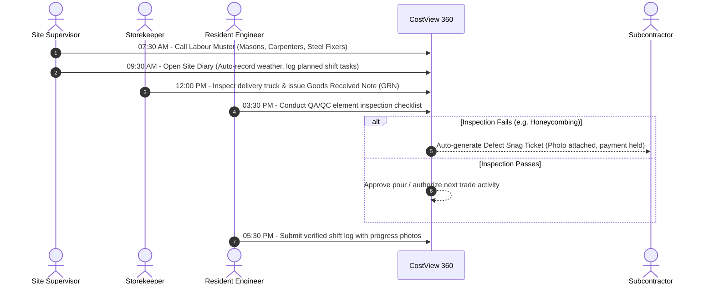
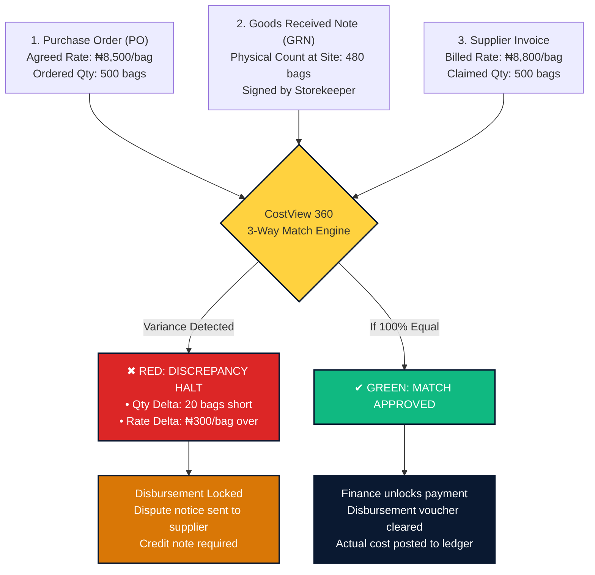
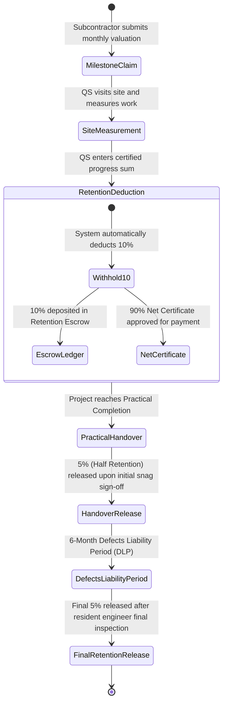
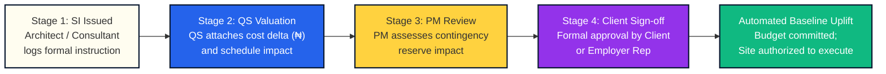

# CostView 360 · User Operations Guide & Process Manual

> **Commercial Construction Intelligence & Field Cost Governance**  
> *Authoritative User Handbook for Quantity Surveyors, Project Managers, Site Engineers, Procurement Officers & Financial Controllers.*

---

## 1. Executive Mandate: Eliminating Cost Leakage

Commercial construction projects across Nigeria and emerging markets routinely suffer from **15% to 30% unbudgeted cost inflation**, unrecorded verbal site variations, material shrinkage, and unverified contractor invoices. 

**CostView 360** bridges the operational gap between physical jobsite events and commercial finance controllers. By enforcing strict Bill of Quantities (BOQ) baselines, automated 3-way invoice matching, statutory 10% retention withholding, and daily shift records, CostView 360 guarantees that every payment corresponds to verified physical site progress.

### The 4 Core Operational Tenets

```mermaid
mindmap
  root((CostView 360))
    NGN-Native Valuation
      Primary accounting in Naira (₦)
      Real-time conversion to USD, GBP, EUR for imported MEP plant
      Zero rounding error on multi-billion ledgers
    Automated 3-Way Match
      Purchase Order (PO) rate verification
      Goods Received Note (GRN) physical count
      Vendor Invoice reconciliation
      Zero-tolerance variance lock
    10% Statutory Retention
      Standard FIDIC / JCT contract enforcement
      Automatic withholding per interim certificate
      Cumulative escrow fund tracking
      Two-stage release (Handover + 6-month DLP)
    Dual-Signoff Governance
      Separation of duties (Field recording vs Commercial certification)
      Legally defensible site diary logs
      4-stage variation approval pipeline
```

---

## 2. End-to-End System Data Flow Architecture

The diagram below illustrates how operational data originates on the construction site and flows through the commercial verification engine to the executive financial dashboard:

```mermaid
flowchart TD
    subgraph FIELD["Tier 1: Field Site Operations & Store"]
        D1["Daily Site Diary\n(Weather, Headcount, Delays)"] --> M1["Labour Muster Roll\n(Daily Artisan Attendance)"]
        M1 --> G1["Material Deliveries\n(Goods Received Note - GRN)"]
        G1 --> I1["Element Inspections\n(QA/QC Checklists)"]
        I1 -->|Failed Inspection| S1["Auto-Generated Defect Snag\n(Assigned to Subcontractor)"]
    end

    subgraph COMMERCIAL["Tier 2: Commercial & Procurement Engine"]
        B1["BOQ Baseline Budget\n(Cost Codes & Unit Rates)"] --> P1["Purchase Orders (PO)\n(Contracted Supplier Rates)"]
        G1 -.->|Verified Physical Quantities| T1{"Automated 3-Way Match Engine\n(PO vs GRN vs Invoice)"}
        P1 --> T1
        V1["Vendor Invoices"] --> T1
        
        T1 -->|Zero Variance (100% Match)| C1["Payment Certification"]
        T1 -->|Variance Detected| D2["Discrepancy Halt\n(Payment Blocked)"]
        
        W1["Subcontractor Interim Claim"] --> R1["QS Physical Site Valuation\n& Measurement"]
        R1 --> R2["Automatic 10% Retention\nWithheld to Escrow"]
        R2 --> C1
    end

    subgraph EXECUTIVE["Tier 3: Executive Financial Command Center"]
        C1 --> E1["Committed vs Actual Cost Ledger"]
        E1 --> K1["Live Project KPIs\n(CPI, SPI, Budget Health, Contingency)"]
        
        SI["Site Instruction (SI) Issued"] --> VO["4-Stage Variation Order"]
        VO -->|Client Approved| B1
        
        K1 --> REP["One-Click PDF Reports\n(Bank Valuation & Boardroom Summaries)"]
    end

    style FIELD fill:#FFFDF0,stroke:#0A1931,stroke-width:2px
    style COMMERCIAL fill:#FFFDF0,stroke:#0A1931,stroke-width:2px
    style EXECUTIVE fill:#FFFDF0,stroke:#0A1931,stroke-width:2px
    style T1 fill:#FFD23F,stroke:#0A1931,stroke-width:2px
    style R2 fill:#9333EA,color:#fff,stroke:#0A1931,stroke-width:2px
    style C1 fill:#10B981,color:#fff,stroke:#0A1931,stroke-width:2px
    style D2 fill:#DC2626,color:#fff,stroke:#0A1931,stroke-width:2px
    style K1 fill:#0A1931,color:#fff,stroke:#0A1931,stroke-width:2px
```

---

## 3. The 10 Core Functional Subsystems

| Module Name & Path | Primary Actors | Step-by-Step "What To Do" | Value & Protection Delivered |
| :--- | :--- | :--- | :--- |
| **1. Commercial Command Center**<br>`/` | Project Director, Commercial Manager | 1. Review Top KPIs: Total Budget, Committed Cost, Paid to Date, Contingency Burn.<br>2. Check Project Health Badge (On Track, At Risk, Over Budget).<br>3. Monitor CPI (Cost Performance Index) and SPI (Schedule Performance Index). | Instant executive oversight; flags cost code overruns before commitments are made. |
| **2. BOQ Baseline Budget**<br>`/budget` | Senior Quantity Surveyor | 1. Click "Import Excel / CSV" to upload approved Bill of Quantities.<br>2. Assign NRM2/CESMM4 cost codes (SUB, CON, BLK, FIN, MEP).<br>3. Set project contingency reserve (e.g. 5.0%).<br>4. Click "Lock Baseline" to freeze master commercial benchmark. | Prevents unapproved budget inflation. Changes require formal Variation Orders. |
| **3. Procurement & POs**<br>`/procurement` | Procurement Lead, Quantity Surveyor | 1. Review requisitions submitted by site supervisors.<br>2. Obtain and compare 3 competitive supplier quotes.<br>3. Issue Purchase Order (PO) locking unit rates and delivery schedule.<br>4. Route PO for commercial manager authorization. | Eliminates off-contract spot buying; enforces supplier accountability. |
| **4. 3-Way Invoice Match**<br>`/procurement` *(Match Tab)* | Financial Controller, Accounts Payable | 1. When vendor invoice arrives, open 3-Way Match screen.<br>2. Reconcile PO unit rates vs physical GRN delivery counts vs Invoice sum.<br>3. If matched 100%, click "Approve for Payment".<br>4. If rate or quantity differs, click "Raise Dispute". | Halts unverified disbursements and prevents double-billing and phantom charges. |
| **5. Materials & Stock Control**<br>`/materials` | Storekeeper, Materials Engineer | 1. Log incoming delivery trucks; issue Goods Received Note (GRN).<br>2. Record physical counts (e.g. 500 bags cement, 12 tonnes rebar).<br>3. Record daily material issues to artisan crews by BOQ zone/grid.<br>4. Monitor stock gauge meters; order replenishment when meters hit yellow. | Reconciles theoretical BOQ allowance against actual usage; prevents site shrinkage. |
| **6. Labour Muster & Rolls**<br>`/labour` | Site Supervisor, HR Officer | 1. Conduct 07:30 AM morning muster roll.<br>2. Check in skilled artisans (masons, carpenters, iron benders) and helpers.<br>3. Record authorized night overtime hours with supervisory sign-off.<br>4. Reconcile weekly muster records against contractor workforce invoices. | Eliminates ghost-worker payroll fraud; ties labor costs to verified attendance. |
| **7. Site Operations & Diary**<br>`/site-ops` | Resident Engineer, QA/QC Inspector | 1. Log daily shift weather, delays, and critical work progress.<br>2. Upload timestamped milestone progress photographs.<br>3. Conduct structural element inspections (formwork, rebar spacing).<br>4. If inspection fails, system auto-generates a defect Snag assigned to the trade. | Legally defensible shift records; cloud sync prevents log tampering. |
| **8. Subcontractor Packages**<br>`/subcontractors` | Quantity Surveyor, Project Manager | 1. Award trade packages with contracted scopes and values.<br>2. When contractor submits monthly valuation, verify progress on site.<br>3. Enter certified sum; system automatically deducts 10% statutory retention.<br>4. Issue Interim Payment Certificate and record 4-factor performance grade. | Enforces 10% retention fund on every claim; tracks subcontractor performance. |
| **9. Variations & Instructions**<br>`/site-ops` *(Tabs 7.1 & 7.2)* | Architect, Resident Engineer, QS | 1. Consultant issues formal Site Instruction (SI) with sketches.<br>2. QS links SI to a Variation Order (VO) and values cost/time delta.<br>3. Route through 4 stages: Draft → QS Valuation → PM Review → Approved.<br>4. Upon client approval, system automatically uplifts budget baseline. | Eliminates verbal instruction disputes; ensures client approves cost deltas. |
| **10. Reports Studio & Exports**<br>`/reports` | Commercial Director, Client Rep | 1. Select project and required reporting period.<br>2. Choose report: Executive Cost Summary, Subcontractor Ledger, or Audit Log.<br>3. Generate high-resolution, branded PDF documents with one click.<br>4. Distribute to banks, partners, and executive board. | Boardroom-ready financial transparency with cost-to-complete forecasts. |
| **11. AI Early Cost Estimator**<br>`/dashboard` *(Tab 2.6)* | Project Director, Quantity Surveyor | 1. Select building archetype (duplex, apartment, office, warehouse).<br>2. Set location, GFA (m²), finish tier, and foundation type.<br>3. Review composite cost, NRM2 elemental package breakdown, and raw material demand.<br>4. One-click "Convert to Draft BOQ Master" or export pro-forma feasibility sheet. | Enables instant feasibility appraisal and preliminary budget forecast before architectural drawings exist. |
| **12. Vetted Trade & Supplier Directory**<br>`/dashboard` *(Tab 4.6)* | Procurement Lead, Project Manager | 1. Search verified suppliers for cement, steel, aggregates, and plant rental.<br>2. Filter vetted artisan trade guilds (iron benders, carpenters, blocklayers).<br>3. Compare live market benchmark rates and review CAC/yard audit credentials.<br>4. Dispatch direct RFQ quotation requests linked to project cost codes. | Eliminates rogue vendor selection and middleman markups with verified supplier credentials. |
| **13. Client & Diaspora Investor Portal**<br>`/portal` *(Tab 1.4)* | Diaspora Property Owner, Board Investor | 1. Share authenticated read-only access link with project owners.<br>2. View physical completion percentage and milestone schedule progress.<br>3. Inspect date-stamped high-res photo gallery and drone survey logs.<br>4. Review certified work-in-place, funds disbursed, and 10% statutory retention escrow. | Delivers transparent investor oversight and proof of progress without exposing internal contractor margins. |

---

## 4. Step-by-Step Standard Operating Procedures (SOPs)

### SOP 1: Project Setup & Baseline Budget Locking (Day 1)
1. **Log in** with Quantity Surveyor (QS) credentials and navigate to **BOQ & Budget**.
2. Click **Import Excel / CSV BOQ** and upload the approved Bill of Quantities.
3. Verify that line items are mapped to standard cost codes (`SUB` Substructure, `CON` Concrete, `BLK` Masonry, `FIN` Finishes, `MEP` Mechanical/Electrical).
4. Establish the **5.0% contingency reserve fund** to absorb unforeseen market price escalations.
5. Click **Lock Baseline**. Once locked, the master contract budget cannot be edited without formal Variation Orders.

---

### SOP 2: Daily Field Site Execution & Quality Snag Routine



---

### SOP 3: Procurement & Automated 3-Way Invoice Matching



---

### SOP 4: Subcontractor Valuations & 10% Statutory Retention Lifecycle



---

### SOP 5: 4-Stage Variation Order (VO) Change Management



---

## 5. Status Badge Dictionary & Troubleshooting Matrix

### Standard Status Badges

| Badge | Color | Trigger Condition | Required User Action |
| :--- | :--- | :--- | :--- |
| **ON TRACK** | Green (`#10B981`) | Expenditure is within approved BOQ baseline and contingency buffer. | Continue standard execution; no commercial intervention needed. |
| **AT RISK** | Amber (`#D97706`) | Cost code has exceeded 85% of budget or variance delta exceeds 5%. | QS must review upcoming commitments and inspect material wastage. |
| **OVER BUDGET** | Red (`#DC2626`) | Committed costs exceed 100% of approved baseline allocation. | Requires formal Variation Order or contingency draw-down approval. |
| **MATCHED** | Green (`#10B981`) | PO unit rate, GRN physical count, and vendor invoice agree 100%. | Finance authorizes invoice for payment disbursement. |
| **DISCREPANCY** | Red (`#DC2626`) | Unit price is higher than PO, or billed quantity exceeds physical GRN. | System halts payment. Procurement contacts vendor for credit note. |
| **RETAINED (10%)** | Purple (`#9333EA`) | Statutory 10% withheld from interim certificate into escrow ledger. | Held securely until Practical Completion and defect snag clearance. |
| **SNAG OPEN** | Amber (`#D97706`) | Defect ticket logged from failed site inspection or supervisor check. | Contractor must rectify defect; blocks final milestone certification. |
| **SNAG CLOSED** | Green (`#10B981`) | Resident Engineer re-inspected physical repair and verified quality. | Rectification recorded in diary; releases trade milestone payment. |

### Field Troubleshooting Matrix

| Operational Site Scenario | Immediate In-App Action Required | Commercial Protection Delivered |
| :--- | :--- | :--- |
| **Supplier delivers partial order** *(e.g. 80 bags delivered vs 100 on PO)* | Storekeeper enters exact physical count (`80`) on the Goods Received Note (GRN). Do not enter 100. | 3-Way Match locks invoice if vendor bills for 100. Eliminates paying for 20 undelivered bags. |
| **Vendor invoice unit price is higher than agreed Purchase Order rate** | Open 3-Way Match, review red price variance flag, and click "Raise Dispute" with an attached note. | Halts payment disbursement until supplier reissues invoice with the contracted rate. |
| **Subcontractor objects to 10% statutory retention deduction** | Refer contractor to standard contract retention terms. Show cumulative retention escrow balance. | Maintains mandatory client defect guarantee fund per Nigerian construction industry standards. |
| **Torrential rain halts concrete pour or earthworks on site** | Open **Site Diary**, record exact rain duration and delay hours, and attach site photos. | Provides contemporaneous legal documentation required to evaluate Extension of Time (EOT) claims. |
| **Material stock level indicator turns yellow or red** | Open **Materials & Stock** and click "Create Reorder Request" before warehouse inventory is depleted. | Prevents costly site shutdowns and emergency spot-buying at inflated retail prices. |
| **Structural inspection fails** *(e.g. honeycombing on column)* | Resident Engineer marks inspection "Failed" and uploads photo. System auto-generates Snag ticket. | Blocks trade milestone payment certification until contractor performs approved structural repair. |

---

## 6. Enterprise Role-Based Access Control (RBAC) & User Management Hub

CostView 360 features an interactive, enterprise-grade identity and role administration engine under **Administration > User & Role Customization**.

### Key Administrative Capabilities

1. **User Provisioning & Invitation**:
   - Administrators can provision new site engineers, quantity surveyors, accountants, and project managers directly via `+ Create New User`.
   - Credentials, contact numbers, and default roles are assigned and stored with real-time audit logging.
2. **Dynamic Role Re-Assignment**:
   - Change any team member's role dynamically using the in-table role dropdown. Modifications apply immediately across their active session.
3. **Interactive Role Permissions Matrix (8 Roles × 9 Permissions)**:
   - Configure fine-grained access across `Budget`, `Procurement`, `Materials`, `Labour`, `Progress`, `Subcontractors`, `Variations`, `Reports`, and `Admin`.
   - Toggle module capabilities per role with real-time synchronization to Supabase `role_access`.
4. **Expanding Sub-Navigation Hierarchy**:
   - Direct 1-click access to all sub-registers (e.g. `3.2 Material Requisitions`, `4.4 Snags & NCRs`, `5.2 10% Retention Escrow`) via the collapsible sidebar tree and header breadcrumb trail.

---

*CostView 360 · Version 2.1 · Comprehensive Enterprise Operations & Field Governance Manual*

